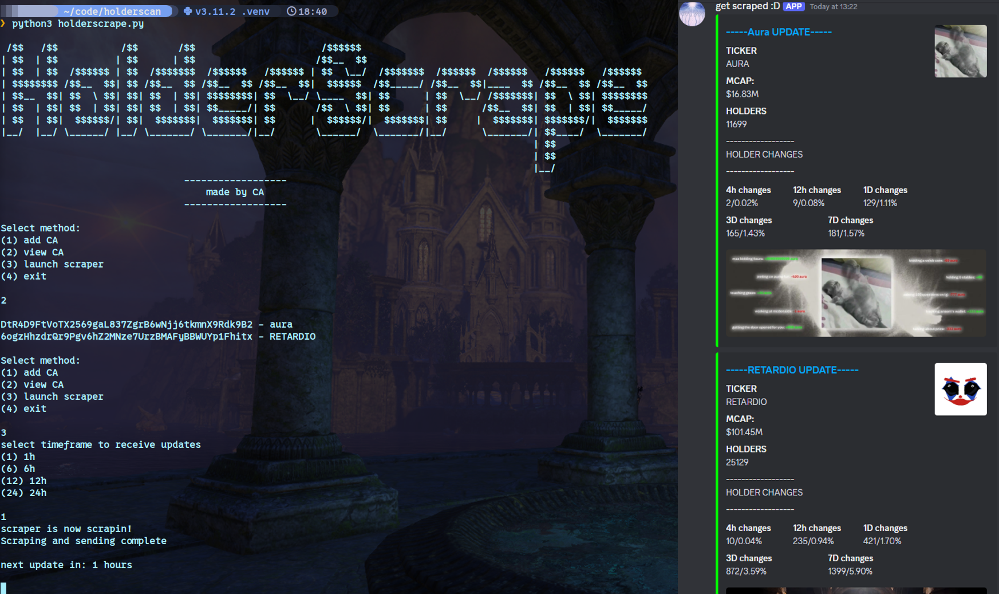

# HolderScrape
### A webscraper for [holderscan](https://holderscan.com) that provides real-time updates on holder changes for tokens on-chain
Note: The script has minimal support for EVM tokens for now, works mainly for SOL.

<<<<<<< HEAD


=======

>>>>>>> 97cb288 (tweaking READM.me)

## prerequisite
* Firefox
  * currently this script only works with Firefox.
* Mozilla geckodriver
  * install the geckodriver, extract it and add it to path: [Github link](https://github.com/mozilla/geckodriver/releases)
  * this driver is necessary for Selenium to work
* Discord webhook
  * this is where you will receive your holder change updates

## installation & setup
```
git clone https://github.com/contractaddress/holderscrape.git 
cd holderscrape/
```
###### Virtual environment
```
python3 -m venv .venv
source .venv/bin/activate
```
###### Install necessary dependencies
```
pip install -r requirements.txt
```
###### Setup your discord webhook
inside holderscrape(dot)py edit line 19 variable to your discord webhook   
`webhook_url = os.getenv('DISCWEBHK')` e.g. `webhook_url = 'your_webhook'`  
or just add it as an environment variable to your shell file  
`export DISCWEBHK='your_discord_webhook_here'`

##### Launch script
```
cd src/
python3 holderscrape.python3
```
## Usage
use one of the methods:  
* add CA 
* view CA 
* launch scrapper 
* exit  

"add CA" will also automatically create a CA.txt file which can be used to remove unwated contract addresses
## Recommendations
* Try to stick below 4 contract addresses at a time per VPS.
* if you want to scrape more, use rotating residential Proxies.
* using a linux machine (no current testing on windows)
* be nice to Mr. holderscan
